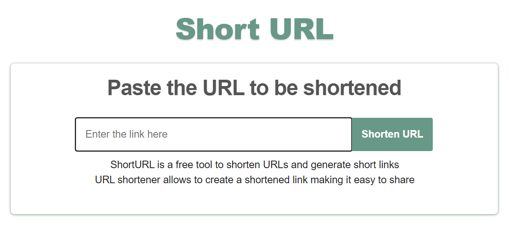
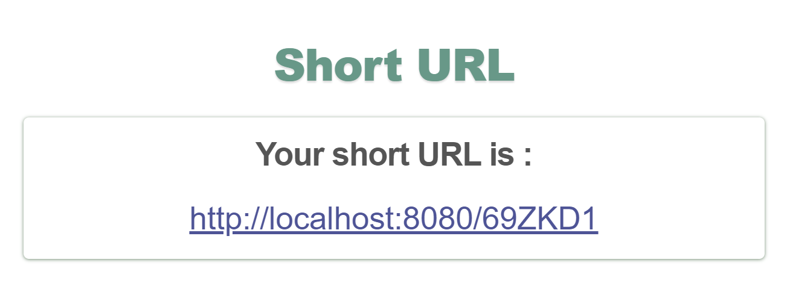
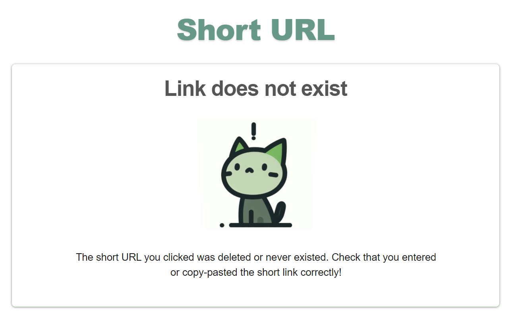

# URL Shortener
ShortURL is a free tool to shorten URLs and generate short links. URL shortener allows to create a shortened link making it easy to share.
## Technology stack
This software is based on `Spring Boot` framework.

`Thymeleaf` is used for UI rendering.

`JUnit`, `Mockito`, `SpringBoot Test` are used for testing.

### User interface languages (i18n)

This Spring Boot project provides multilingual support for 5 languages using `MessageSource` for internationalization.
* English
* French
* German
* Italian
* Russian

## Screenshots

### Home page

### Result page

### Error page

